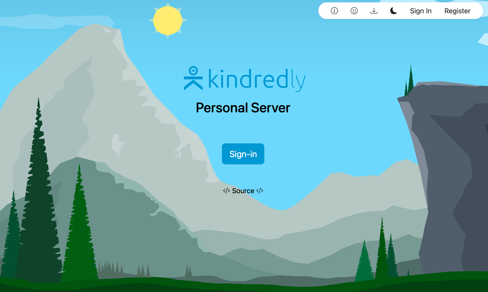

# Kindredly Personal Edition

Kindredly Personal Edition is a free, open-source, and self-hosted version of our Kindredly server designed for individuals and families.

> **NOTE:** Personal Edition is a work in progress and still may be difficult to install. Please stay tuned for updated and better documentation.

## Requirements
- docker (https://docs.docker.com/get-docker/)
- docker-compose (https://docs.docker.com/compose/)

## Installation 
1. Clone the repository
1. Run `./build_docker_personal.sh`
1. Run `./start_server_personal.sh` (this will fail, but will setup the database)
1. Run `./start_server_personal.sh` (run again)
1. Visit to http://localhost:4444

## Browser Extensions Setup
- Install the browser extension from the Chrome Web Store (https://kindredly.ai/download)
- Visit the custom server settings link on the Sign-in page and give IP address and port of the server (http://localhost:4444/api/v2.3)

## Planned Features
 - One click installer
-  Native webview for Windows, Mac and Linux with server management options as well as local webapp access
 - Relay Server for remote access to your server without the need to open ports to your network.
 - Backup and restore features
 - Intergration with Kindredly Published Content
 - Android and IOS app support
 
